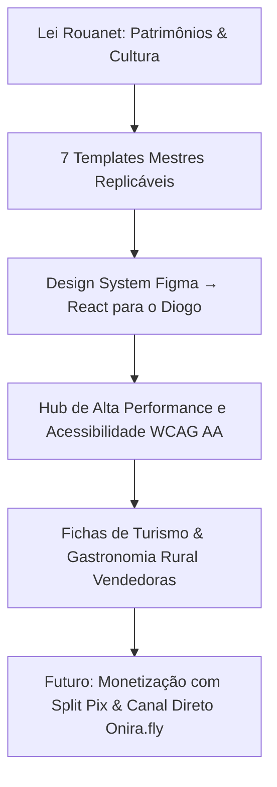

# Plano de Sustentação Estratégica & Inteligência — Reunião Soul Branding
**Projeto:** Modernização do Guia de Caxias do Sul (Lei Rouanet & Design System)  
**Preparação Executiva:** Jefferson Motta (Onira Labs)  
**Interlocutor Soul Branding:** Mateus Loreto  
**Data:** Setembro / 2026  
**Status:** Documento interno de preparação e blindagem de tese comercial

---

## 1. O Diagnóstico: O "Apagão Digital" do Interior de Caxias do Sul

A auditoria técnica sobre a base do **Guia de Caxias do Sul (561 estabelecimentos mapeados)** revelou um dado crítico que muda completamente a postura da conversa com a Soul Branding:

> 🔴 **58,3% dos estabelecimentos auditados NÃO POSSUEM site próprio.**  
> E quando isolamos o setor de **Gastronomia Rural, Turismo Rural, Vinhos e Queijarias**, a taxa de ausência de presença web salta para **75% a 85%**.

### Por que esse dado é alarmante e estratégico?
1. **Invisibilidade na Busca:** O turista de Porto Alegre, Região Metropolitana ou de fora do estado planeja a viagem no Google e no ChatGPT/Perplexity antes de sair de casa. Sem site indexável e sem SEO semântico, essas cantinas e propriedades em distritos (Criúva, Forqueta, Ana Rech, Galópolis, Fazenda Souza) **simplesmente não existem na busca orgânica**.
2. **Dependência Crítica do Guia:** Para centenas de produtores, a ficha cadastral do Guia de Caxias é o **único endereço web indexável que eles têm no planeta**.
3. **A Ilusão do Instagram:** A maioria tenta compensar apenas com perfil no Instagram. Mas o Instagram não tem SEO local indexável no Google, não tem cardápio navegável limpo, e a entrega orgânica dos algoritmos é decrescente.
4. **O Gargalo de Hospedagem / Airbnb:** No turismo rural e pousadas dos distritos, os estabelecimentos que tentam captar hóspedes fora do boca a boca ficam reféns de taxas de 15% a 20% do Airbnb/Booking, ou operam apenas com WhatsApp desorganizado.

---

## 2. A Tese de Sustentação para a Soul Branding

Mateus Loreto precisa enxergar que o nosso escopo de **R$ 22.800 (Blocos A + B + C + D)** não é um custo de "desenhar telas bonitas para prestar contas da Lei Rouanet", mas sim o **investimento que salva a relevância do Guia e constrói o ecossistema digital da região**.

### Argumentos Âncora para Mateus Loreto:
* **Argumento 1 — A Rouanet é o trampolim, não o teto:** A Rouanet financia a infraestrutura base (Design System e os 7 Templates Mestres). Ao criar templates flexíveis, o Diogo (TI) reaproveita o mesmo código para o turismo rural, gastronômico e comercial sem gastar mais nada.
* **Argumento 2 — O Guia como autoridade incontestável:** Se 80% do interior não tem site, quem modernizar a ficha e oferecer carregamento rápido, mapa claro e botão WhatsApp com mensagem pré-formatada se torna o **portal oficial e indispensável da Serra Gaúcha**.
* **Argumento 3 — Blindagem Técnica para o Diogo:** O Diogo não precisará programar 561 páginas. Ele programa **7 componentes mestres no React**, e o banco de dados popula automaticamente. O risco de refação é ZERO.
* **Argumento 4 — Sustentação dos R$ 22.800:** Menos de R$ 3.250 por template mestre completo (Desk + Mobile + Design System + WCAG AA). Tentar fazer isso fragmentado ou internamente custaria o triplo em horas de retrabalho e risco de glosa na prestação de contas do MinC.

---

## 3. Matriz de Cruzamento de Dados (4 Fontes)

Para aprofundar a inteligência e levar dados irrefutáveis para a reunião, estruturamos o cruzamento de 4 fontes:

| Fonte | O Que Extrair | O Que Esse Dado Revela | Status / Ação |
|---|---|---|---|
| **1. Guia de Caxias do Sul** | 561 negócios cadastrados, contatos, categorias, endereços | Base de autoridade e cobertura do cliente | ✅ Extraído (60 auditados na amostra canônica) |
| **2. Google Meu Negócio (GMB)** | Presença no Maps, reivindicação de ficha, volume de reviews, link de site cadastrado | Se o negócio existe no mapa oficial do Google e se tem site apontado | 🔄 Cruzamento prioritário nos nichos rurais |
| **3. Instagram** | Link na bio (Linktree, WhatsApp ou site), seguidores, última postagem | Nível de maturidade digital e dependência de redes sociais | 🔄 Cruzamento das contas ativas |
| **4. Airbnb & Hospedagem Rural** | Listagens ativas em Caxias/distritos, diárias médias, taxa de ocupação, comissões | Quem está na hotelaria/experiência rural e quanto deixa na mesa em taxas | 🔄 Mapeamento dos distritos (Criúva, Ana Rech, Forqueta) |

---

## 4. Nichos Prioritários para Cruzamento & Prospecção

### Nicho A: Gastronomia Rural & Cantinas Típicas (46 no portal)
- **Foco geográfico:** Linha 40, Forqueta, Criúva, Galópolis, Santa Lúcia do Piaí.
- **Dor central:** Turista quer saber horário, cardápio típico (galeto, sopa de capeletti, polenta brustolada) e se precisa reservar. Sem site, o telefone toca fora de hora ou o turista vai para Bento Gonçalves/Gramado.
- **Solução Guia/Onira:** Ficha moderna com galeria apetitosa, mapa offline/rotas e botão de reserva rápida.

### Nicho B: Turismo Rural & Compras Direto do Produtor (51 no portal)
- **Foco:** Produtores de morango, queijarias coloniais, emporinhos artesanais.
- **Dor central:** 80% sem presença web. Dependem de placas na beira da estrada.
- **Solução Guia/Onira:** Vitrine dos produtos coloniais no Guia, atraindo o visitante para a propriedade.

### Nicho C: Vinhos & Espumantes sem Site (31 no portal)
- **Foco:** Cantinas familiares e vinícolas boutiques (ex.: Cantina Tonet, Casa Motter, Granja do Vale).
- **Dor central:** Enquanto vinícolas de grande porte têm e-commerce, as familiares não conseguem vender degustações antecipadas.
- **Solução Guia/Onira:** Template de degustação com modelo futuro de Voucher / Split Pix.

### Nicho D: Hospedagem Rural & Experiências (Airbnb x Guia)
- **Foco:** Cabanas em Criúva, chalés em Ana Rech, pousadas coloniais.
- **Dor central:** Dependência do Airbnb (taxas altas) ou isolamento total.
- **Solução Guia/Onira:** Inclusão no mapa interativo de roteiros de fim de semana de Caxias do Sul.

---

## 5. Roteiro Prático da Reunião com Mateus Loreto (Soul Branding)

### Bloco 1: Abertura & Validação de Inteligência (5 a 8 min)
* *"Mateus, antes de falar de telas e botões, rodamos uma auditoria profunda na base real dos 561 cadastros do Guia. O que encontramos é impressionante e muda o jogo."*
* Apresentar o número: **58,3% no geral e mais de 80% no interior não têm site**.
* Conclusão de negócio: *"O Guia não é um catálogo de luxo; ele é o oxigênio digital de quem faz o turismo de Caxias acontecer."*

### Bloco 2: A Solução de Engenharia de Design (10 min)
* Explicar a lógica dos **7 Templates Mestres Replicáveis**:
  1. Home Hub
  2. Categoria / Filtros
  3. Ficha Geral de Negócio / Gastronomia
  4. Distrito / Região
  5. Hub Rouanet (Patrimônio & Lendas)
  6. Mapa Interativo com Sheets
  7. Editorial / Notícias
* Destacar o ganho do Diogo (TI): *"O Diogo não vai programar 500 telas. Ele consome o Design System no React e popula com o banco de dados que já existe. Menos de 1 mês de trabalho conjunto."*

### Bloco 3: Segurança Rouanet & WCAG 2.1 AA (5 min)
* Lembrar que o Ministério da Cultura exige conformidade de acessibilidade para evitar glosa ou devolução de verba. Nosso Bloco B já entrega a paleta contrastada e acessível dentro da regra do jogo.

### Bloco 4: Fechamento & Firmeza de Preço (5 min)
* Sustentar com naturalidade o pacote de **R$ 22.800**:
  - Fracionado daria R$ 24.400.
  - O pacote integrado a R$ 22.800 entrega Diagnóstico UX + Design System React + 7 Templates Desk + Adaptação Responsiva Mobile + 2 rodadas de revisão + sincronização técnica com o Diogo.
* *"É uma entrega de nível estúdio sênior, desenhada para valorizar a entrega da Soul Branding e deixar o cliente final sem palavras."*

---

## 6. Checklist de Ações Imediatas (Plano de Trabalho)

- [x] Correção do nicho para Gastronomia Rural no relatório de inteligência
- [x] Criação do plano de sustentação estratégica executiva
- [ ] Conduzir raspagem complementar dos dados de GMB e Instagram das 46 rurais + 51 de turismo rural
- [ ] Mapear as opções de hospedagem / cabanas rurais no Airbnb da região de Caxias / Criúva
- [ ] Ter em mãos os links de teste do simulador Figma (`proposta/index.html`) e do ecossistema de Split Pix (`proposta/ecossistema-e-modelos.html`) para eventual demonstração visual.
